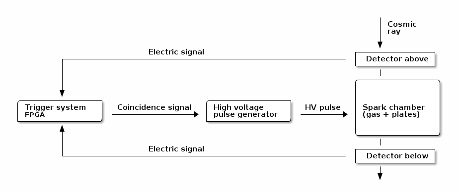

Construction of a spark chamber
==========

This document describes the construction of a spark chamber detector
for educational purposes.

What is a spark chamber
-----------------------

A spark chamber
([wikipedia](http://en.wikipedia.org/wiki/Spark_chamber)) is a
particle detector. It allows to detect and visualize subatomic
particles that costitute all the matter that surround us (including
ourselves!). In some way, a spark chamber is the ancestor of the
particle detectors that, for example, were used at the Large Hadron
Collider to discover the Higgs boson.

What are cosmic rays
--------------------

The particles that one can visualize with a spark chamber are
fundamental particles. We call them *fundamental* because we believe
that they cannot be broken down into smaller pieces. They are so small
that we usually do not see them in our everyday life, because we only
see the bigger objects in which the fundamental particles aggregate,
such as atoms and molecules. However, sometimes these particles can
move at a very large speed, and they can travel lonely without
aggregating into atoms.  For example, the particles produced in the
stars in outer space, can travel at relativistic speeds until they
reach us. We call them cosmic rays
([wikipedia](http://en.wikipedia.org/wiki/Cosmic_ray)), and they
continuosly hit our planet. In fact, if you keep your hand horizontal,
there are a few cosmic rays going through it every second.

The goal of this project is to build a spark chamber to visualize
these cosmic rays, to learn how we can detect these particles, and to
learn about particle physics.

Overview of the project
-----------------------

In this section we briefly illustrate the main parts that need to
be built for this project.

The spark chamber is essentially set of parallel metal plates in a
gas-filled volume. When the particle goes through the gas, it breaks
up some of the gas atoms, creating pairs of negatively-charged
electrons and positively-charged ions. Because these two have opposite
charges, they attract each other, and quickly recombine into
atoms. This happens within microseconds. However, if a large electric
field is applied to the metal plates before the electrons and ions
recombine, then the electrons are accelerated by the electric field,
and they hit other atoms, which produce other electrons, and the
overall result is that one can see a little spark right where the
original cosmic muon was. You can see this for example on these videos
on youtube
([link](http://www.youtube.com/results?search_query=spark+chamber)).

However, for this to happen, one needs to
1. have the metallic plates positioned at the right distance, and the
gaps filled with an appropriate gas; this involves the construction of
the *spark chamber* itself.
2. apply to the plates a high voltage very quickly; this involves the
construction of a *high-voltage pulse generator*.
3. only apply the high voltage when there actually a cosmic muon; this
involves the construction of a *trigger system*.

The chamber can be built as a plexiglass box with aluminum plates in
it. The box has to be transparent, so that we can see the sparks, and
air tight, so that we can fill it with gas. The gas will be a mixture
of 30% Helium 70% Neon. The tightness of the box is very important
because we want to avoid air infiltrations. The box should also have
the necessary valves allowing to fill it with gas and then seal it. It
should also have the necessary electrical connections to connect the
metallic plates and apply the high voltage.

The high-voltage pulse generator has to provide an 8000 V potential
within less than 500ns from a 'start' signal. Modern commercial
solutions do exist, but they are very expensive (usually above
$1000). Instead we want to investigate two more affordable solutions.
The first one is based on a circuit that can be built from cheaper
electronic components, and that is based on the spark plug used in
automobile engines. The second solution is based on the thyristor, an
electronic tube that was used in early radios and radars before the
advent of solid state devices. Thyristors are still available on the
market, mostly as collectibles, and we know that models such as the
PL5C22 would provide the necessary voltage and current required for
our detector.

The trigger system is a circuit that can determine within nanoseconds
whether a cosmic muon has gone through our spark chamber. The idea is
to have two simpler particle detectors (scintillators) one above and
one below the spark chamber. Each one of them can provide a small
electronic signal when a particle goes through it. The trigger system
should compute whether the signal from the top detector is followed by
a signal from the bottom detector within the very short time that it
takes to the cosmic ray to traverse the spark chamber. Remember that
cosmic rays travel almost at the speed of light. In the past, these
circuits had to be built from basic electronic
components. Fortunately, today there are generic circuits, called
field programmable gate arrays (FPGA), that can be programmed to
perform this kind of tasks. We want to implement our trigger system
with an FPGA.

The project can be summarized with the following scheme:

Possible subproject subdivision
-------------------------------

### Spark chamber prototype

### High-voltage pulser

### FPGA trigger logic
